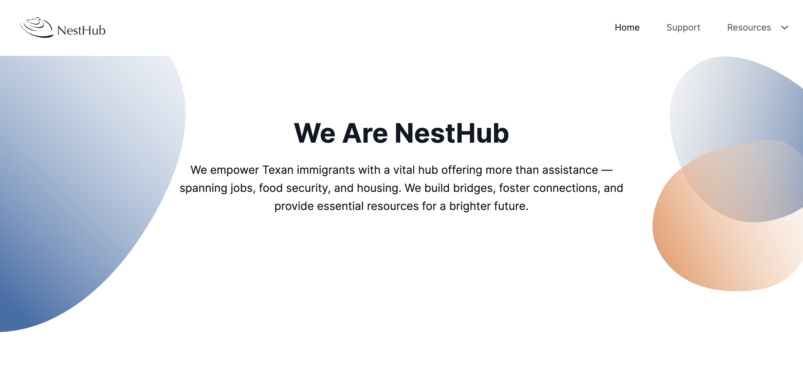

<!-- Improved compatibility of back to top link: See: https://github.com/othneildrew/Best-README-Template/pull/73 -->
<a name="readme-top"></a>


<!-- PROJECT LOGO -->
<br />
<div align="center">
  <a href=https://github.com/ConverseScholar/hackharmony>
    
  </a>


  <p align="center">
   <h1><b> NestHub</h1></b>
    <br />
    <a href=https://github.com/ConverseScholar/hackharmony><strong>Explore the docs »</strong></a>
    <br />
    <br />
    <a href=https://github.com/ConverseScholar/hackharmony>View Demo</a>
    ·
    <a href="https://github.com/ConverseScholar/hackharmony/issues">Report Bug</a>
    ·
    <a href="https://github.com/ConverseScholar/hackharmony/issues">Request Feature</a>
  </p>
</div>


<!-- TABLE OF CONTENTS -->
<details>
  <summary>Table of Contents</summary>
  <ol>
    <li>
      <a href="#about-the-project">About The Project</a>
      <ul>
        <li><a href="#built-with">Built With</a></li>
      </ul>
    </li>
    <li>
      <a href="#getting-started">Getting Started</a>
      <ul>
        <li><a href="#prerequisites">Prerequisites</a></li>
        <li><a href="#installation">Installation</a></li>
      </ul>
    </li>
    <li><a href="#usage">Usage</a></li>
    <li><a href="#roadmap">Roadmap</a></li>
    <li><a href="#contributing">Contributing</a></li>
    <li><a href="#license">License</a></li>
    <li><a href="#contact">Contact</a></li>
   
  </ol>
</details>


<!-- ABOUT THE PROJECT -->
## About The Project

<a href=https://github.com/ConverseScholar/hackharmony>
  
</a>

<a href="https://www.figma.com/file/1EahrY3LVl27XMOZE8oTdQ/NestHub?type=design&node-id=12-1697&mode=design&t=Umx7xEdxUfFXz3QK-0">
 Our Figma designs
</a>

<p align="right">(<a href="#readme-top">back to top</a>)</p>


### Built With

* [![Next][Next.js]][Next-url]
* [![React][React.js]][React-url]
* [![JQuery.com]

<p align="right">(<a href="#readme-top">back to top</a>)</p>


<!-- GETTING STARTED -->
## Getting Started


### Prerequisites

Ensure you have Node.js installed

### Installation

1. Clone the repo
   ```sh
   git clone https://github.com/ConverseScholar/hackharmony
   ```
2. cd into startup-nextjs-main
2. Install NPM packages
   ```sh
   npm install
   ```
3. Run the website 
   ```sh
   npm run dev
   ```

<p align="right">(<a href="#readme-top">back to top</a>)</p>


<!-- CONTRIBUTING -->
## Contributing

Contributions are what make the open source community such an amazing place to learn, inspire, and create. Any contributions you make are **greatly appreciated**.

If you have a suggestion that would make this better, please fork the repo and create a pull request. You can also simply open an issue with the tag "enhancement".
Don't forget to give the project a star! Thanks again!

1. Fork the Project
2. Create your Feature Branch (`git checkout -b feature/AmazingFeature`)
3. Commit your Changes (`git commit -m 'Add some AmazingFeature'`)
4. Push to the Branch (`git push origin feature/AmazingFeature`)
5. Open a Pull Request

<p align="right">(<a href="#readme-top">back to top</a>)</p>


<!-- CONTACT -->
## Contact Us ! 

Chhavi Shah -  [Chhavi's Linkedin] - [Chhavi's-Email]

Joanna Chimalilo - [Joanna's Linkedin] - [Joanna's-Email]

Mashal Pouya - [Mashal's Linkedin] - [Mashal's-Email]


Project Link: [https://github.com/ConverseScholar/hackharmony](https://github.com/ConverseScholar/hackharmony)

<p align="right">(<a href="#readme-top">back to top</a>)</p>


<!-- ACKNOWLEDGMENTS -->
## Acknowledgments

* [RTC-Community]
* [Black Wings Hacks]
  

<p align="right">(<a href="#readme-top">back to top</a>)</p>


<!-- MARKDOWN LINKS & IMAGES -->
<!-- https://www.markdownguide.org/basic-syntax/#reference-style-links -->
[contributors-shield]: https://img.shields.io/github/contributors/github_username/repo_name.svg?style=for-the-badge
[contributors-url]: https://github.com/ConverseScholar/hackharmony/graphs/contributors
[forks-shield]: https://img.shields.io/github/forks/github_username/repo_name.svg?style=for-the-badge
[forks-url]: https://github.com/ConverseScholar/hackharmony/network/members
[stars-shield]: https://img.shields.io/github/stars/github_username/repo_name.svg?style=for-the-badge
[stars-url]: https://github.com/ConverseScholar/hackharmony/stargazers
[issues-shield]: https://img.shields.io/github/issues/github_username/repo_name.svg?style=for-the-badge
[issues-url]: https://github.com/ConverseScholar/hackharmony/issues
[license-shield]: https://img.shields.io/github/license/github_username/repo_name.svg?style=for-the-badge
[license-url]: https://github.com/ConverseScholar/hackharmony/blob/master/LICENSE.txt
[linkedin-shield]: https://img.shields.io/badge/-LinkedIn-black.svg?style=for-the-badge&logo=linkedin&colorB=555
[linkedin-url]: https://linkedin.com/in/linkedin_username
[product-screenshot]: images/screenshot.png
[Next.js]: https://img.shields.io/badge/next.js-000000?style=for-the-badge&logo=nextdotjs&logoColor=white
[Next-url]: https://nextjs.org/
[React.js]: https://img.shields.io/badge/React-20232A?style=for-the-badge&logo=react&logoColor=61DAFB
[React-url]: https://reactjs.org/
[Bootstrap.com]: https://img.shields.io/badge/Bootstrap-563D7C?style=for-the-badge&logo=bootstrap&logoColor=white
[Bootstrap-url]: https://getbootstrap.com
[JQuery.com]: https://www.python.org/static/community_logos/python-logo.png
[Joanna's Linkedin]: https://www.linkedin.com/in/joanna-chimalilo-766a15237/
[Chhavi's Linkedin]: https://www.linkedin.com/in/chhavi-shah/
[Mashal's Linkedin]: https://www.linkedin.com/in/mashalpouya/
[Joanna's-Email]: georgejoanna086@gmail.com
[Chhavi's-Email]: chhavi7.shah@gmail.com
[Mashal's-Email]: pouya.mashal@gmail.com
[RTC-Community]: https://rewritingthecode.org/
[Black Wings Hacks]:https://rewritingthecode.org/black-wings-hacks-2024/

